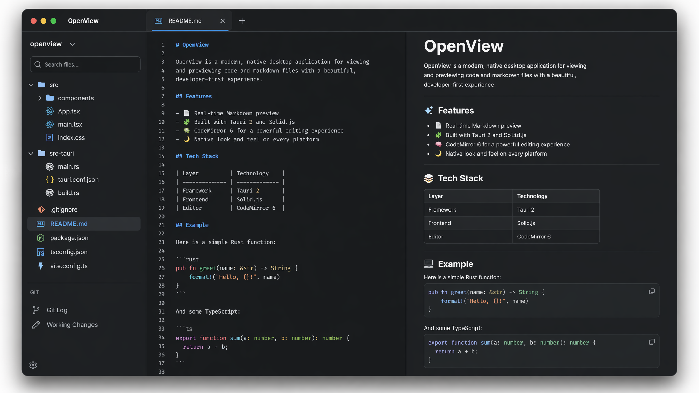

# OpenView

A lightweight, high-performance file viewer for macOS, built with [Tauri 2](https://tauri.app/) + [Solid.js](https://www.solidjs.com/).



## Why OpenView?

In the age of AI-assisted coding, developers increasingly work alongside AI agents (Claude Code, Cursor, Copilot, etc.) that generate and modify code. The human role shifts from writing code to **reviewing AI output** — reading diffs, previewing rendered markdown, checking data files, and browsing project structure.

OpenView is purpose-built for this workflow: an ultra-lightweight, read-oriented viewer that lets you quickly preview and review AI-generated artifacts without the overhead of a full IDE. No plugins, no extensions, no configuration — just open a folder and start reviewing.

## Features

- **Markdown Viewer** — Split-pane viewer with live preview, GFM support (tables, strikethrough, tasklists), hover-to-expand
- **CSV Viewer** — Interactive table with sorting, filtering, and search across all cells
- **Mermaid Diagrams** — Live rendering with pan & zoom, error recovery
- **Git Integration** — Commit history, per-file diff viewer with unified/side-by-side modes
- **Project Switcher** — Quick switch between recent projects (remembers last 10)
- **File Search** — Recursive filename search across the entire project

## Install

Download the latest `.dmg` from [Releases](https://github.com/lijingcheng3359/openview/releases), open it and drag OpenView to Applications.

Since the app is not signed with an Apple Developer certificate, macOS will block it on first launch. Run this command to fix:

```bash
sudo xattr -rd com.apple.quarantine /Applications/OpenView.app
```

## Tech Stack

| Layer | Technology |
|-------|-----------|
| App Framework | Tauri 2 (Rust + system WebKit) |
| Frontend | Solid.js |
| Text Editor | CodeMirror 6 |
| Markdown | pulldown-cmark (Rust, SIMD) |
| CSV | csv crate (Rust) |
| Git | git2 (libgit2 bindings) |
| Diagrams | mermaid.js |
| Diff | diff2html |

## Performance

- ~7 MB binary, ~73 MB memory usage
- No bundled browser engine (uses system WebKit)
- Rust-powered file parsing with SIMD acceleration

## Build

### Prerequisites

- [Rust](https://rustup.rs/) (1.86+)
- [Node.js](https://nodejs.org/) (22+)
- macOS 12+

### Development

```bash
npm install
npx tauri dev
```

### Production Build

```bash
npx tauri build
```

The built app is at `src-tauri/target/release/bundle/macos/OpenView.app`.

## License

[MIT](LICENSE)
